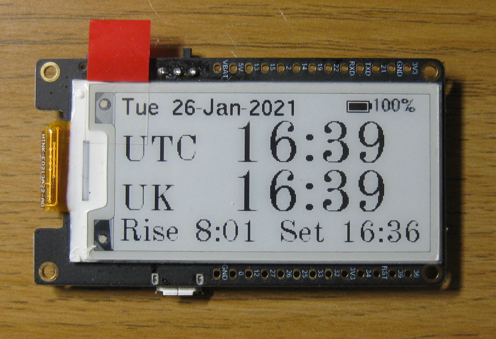

# TTGO T5 e-paper dual timezone clock

A dual timezone clock, based on the Lilygo TTGO T5 2.3_2.13 ESP32 e-paper board.

Designed with the intention for use by Radio Amateurs, who like/need to know both what
time they are really in, and what the UTC time is.

> **NOTE** There is a 'fatal' flaw with the hardware that effecitvely renders this project
> to be an 'interesting code example', and not useful in real life.
>
> Fundamentally, the Real Time Clock (RTC) drifts, a lot, and thus renders the function as
> 'a clock' pretty useless. I saw a 6+ minute drift over the space of about 12 hours.
> 
> The fundamental issue is that the T5 board does not contain a 32KHz xtal, and thus uses an
> internal low speed RC oscillator for the RTC when it is in hibernate mode, and this is
> inaccurate. In theory we could switch to using a higher rate internal osciallator at the
> cost of an extra 5uA sleep current, or we could wire an extern 32KHz xtal to the board
> (the pins are available), and switch to using that - but both of those would require afaict
> a rebuild of the system libraries and potentially some hacking of the startup code, neither
> of which I'm prepared to attack right now.

## Current draw

The whole goal is to run from a battery and a small solar panel. Thus, what we really want is
a very low power draw. In theory we may be able to get down in the uA region.

Ultimately, after some software hackery and a bit of hardware hackery, I got down to about
460uA in sleep mode. Back of the envelope math (see the table below) says we should be able
to get down to more like 250uA, but I could not track down where the extra 210uA is going.

Theoretical minimal hibernate power for the T5 board:

| item | low power |
| ---- | --------- |
| ESP32 | 2.5uA in full hibernate |
| GxGDEH0213B73 e-paper | 2uA |
| ME2611 regulator | 60uA x2 |
| CP2104 USB UART | 100uA suspended |
| TP4054 battery charger | 2uA suspended |
| SPI flash | 4uA power down |
| SPI flash CS pulldown (1Mohm) | 4uA |
| voltage divider (200k@3.7v) | ~19uA @3.7v |
| ---- | --------- |
| total | 253.5uA |

Here are some key elements required to get down to 460uA:

- Remove the power LED - 'LED_G2' from the board. No point lighting that up all the time, and it
  is on the back of the board anyhow! That saves you 0.4mA or so.
- Solder a 1Mohm resistor between the /CS and VCC pins (pins 1 and 8) of the flash chip, to enable
  it to go into 'standby' mode when we hibernate. This saves another 1mA or so.

That should drop your hibernate current from about 1.9mA to 0.46mA.

And then we should also try to reduce runtime current, as that probably (iirc from rough calculations)
consumes the same mAh overall as the hibernation mode. So we:

- Drop the core CPU clock down to the lowest we can once we are done with the wifi, as most of the
  time from then on we are waiting in a spin for the e-paper to update - we may as well wait in the
  lowest power we can.

And then you probably want to remove the 'charging LED' from the board as well, as if you are sipping
power through a solar panel into your battery, why would you want to waste it lighting up a LED.

## Programming the board

This code was developed under the Arduino IDE with the ESP32 dev pack added on. The settings used
to program the board over the USB serial port were:

- Board: TTGO T1
- Upload speed: 921600
- CPU Frequency: 240MHz
- Flash frequency: 40MHz
- Flash mode: DIO
- Flash size: 4MB

## Configuration

Configuration can be done via the serial port, and is stored in the eeprom. The defaults for the
eeprom can be set by editing the `ee_default` structure in the code. When using the serial port,
type '?' to get help on the commands (or look at the `printHelp()` function in the code).

